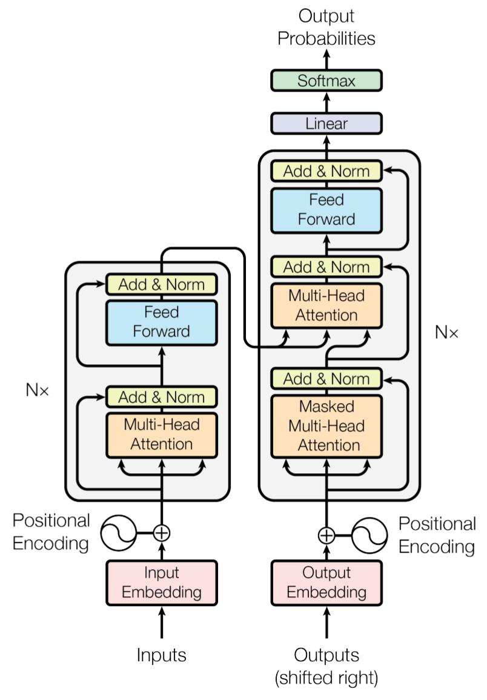

# 论文分享｜Attention Is All You Need

2017 年，Vaswani 等人在 *Attention Is All You Need* 中提出 Transformer。本文用一篇公众号论文分享示例，演示如何把**研究问题、方法图示和证据边界**排成适合手机阅读的文章。

::: summary
**论文**：Attention Is All You Need
**作者**：Ashish Vaswani 等
**发表**：NeurIPS 2017
**原文**：[arXiv:1706.03762](https://arxiv.org/abs/1706.03762)
**关键词**：Transformer、注意力机制、机器翻译
:::

## 01｜论文要解决什么问题

在序列建模中，循环结构需要按时间步处理输入。论文提出一个主要依赖注意力机制的架构，使不同位置之间的信息交互不必经过循环路径。

> 读一篇方法论文时，先分清它改变了什么，再看实验是否支持这种改变。

### 01.1｜阅读线索

1. **问题**：序列中远距离位置怎样交换信息？
2. **方法**：注意力层与位置编码分别承担什么任务？
3. **证据**：作者在哪些机器翻译任务上报告结果？

#### 一个小提醒

这里的“无需循环”描述的是模型结构；它不表示训练和推理没有其他成本。可以把 `Transformer` 当作架构名称，而不是某个单独的公式。

## 02｜方法图解与本地图片

下图采用原论文的 Transformer 总体结构图。左侧为编码器，右侧为解码器；图中的残差连接、归一化与多头注意力，能帮助读者对照原文理解方法。



### 02.1｜缩放点积注意力

查询 $Q$ 与键 $K$ 的相似度经过缩放和 softmax 后，用来加权值 $V$：

$$
\operatorname{Attention}(Q,K,V)=\operatorname{softmax}\left(\frac{QK^{\top}}{\sqrt{d_k}}\right)V
$$

也可以使用标记为 `math` 的围栏书写公式；它会排成公式，而不会显示成蓝底代码块：

```math
\operatorname{softmax}(z_i)=\frac{e^{z_i}}{\sum_j e^{z_j}}
```

::: note
公式用于解释注意力计算。图示只展示信息流，不能代替原论文中的完整模型定义。
:::

## 03｜怎样读实验结果

论文报告了 WMT 2014 英德和英法机器翻译实验。分享结果时，应同时写清任务、对照方法和指标，避免只摘出一个分数。

| 阅读维度 | 要核对的问题 | 公众号写法 |
|---|---|---|
| 任务 | 使用了哪组数据？ | 标明翻译方向和数据集 |
| 指标 | 使用什么评价方式？ | 解释 BLEU 等指标的含义 |
| 对照 | 与哪些系统比较？ | 将基线和模型设置放在一起 |

- **可以说**：作者在所报告的翻译任务上展示了该架构的效果。
- **需要再查**：这些结果能否直接推广到其他任务和数据规模。
  - 先看实验设置。
  - 再看后续研究是否复现。

::: warning
本示例不转录论文的具体分数。正式发布时，请核对原论文表格，并为每个数值注明任务与来源。
:::

## 04｜写作与发布检查

- [x] 用 `#`、`##`、`###` 和 `####` 建立标题层级
- [x] 插入本地 JPG 图片与来源图注
- [ ] 核对论文链接与实验信息
- [ ] 粘贴到公众号后检查图片、公式与手机预览

普通代码块按原样显示文本，不会排版数学公式。下面只演示代码的展示方式：

```python
paper_title = "Attention Is All You Need"
print(paper_title)
```

---

::: conclusion
一篇清楚的论文分享，应让读者看到“问题—方法—证据—边界”的关系。排版服务于理解，发布前仍需回到原论文核对事实。
:::

延伸阅读：[原论文页面](https://arxiv.org/abs/1706.03762)。
